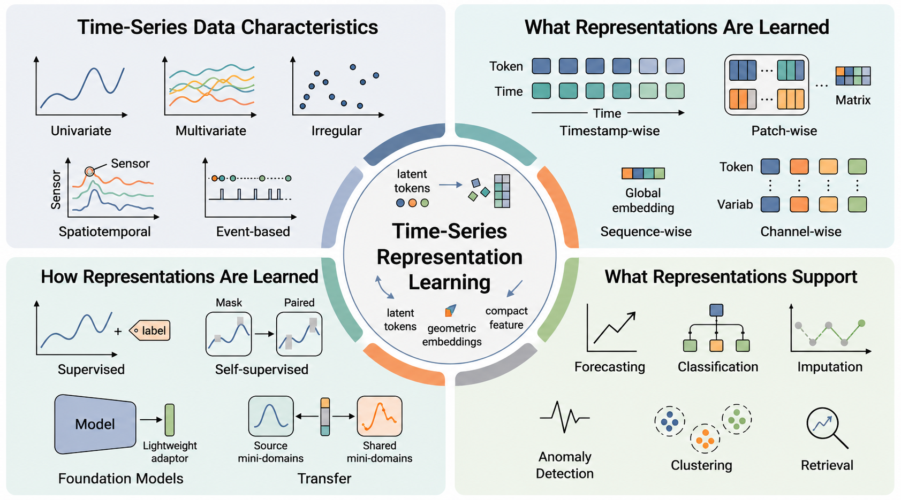
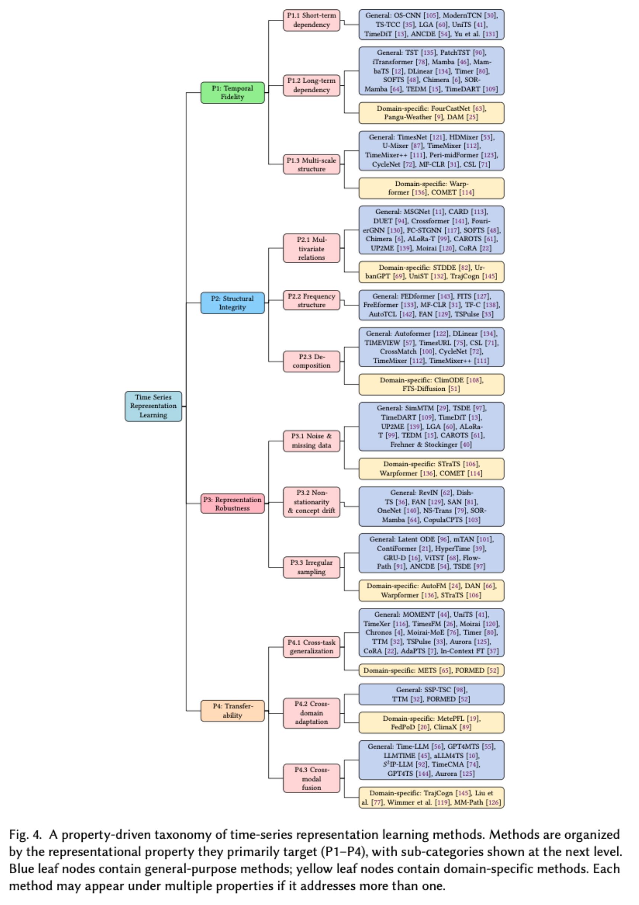

# Property-Driven Time-Series Representation Learning

**Understanding Time-Series Representations: A Property-Driven Survey**

[](https://awesome.re)
[](#contributing)

This repository accompanies the survey **Understanding Time-Series Representations: A Property-Driven Survey** by Kunpeng Xu, Soumaya Cherkaoui, Limei Lin, Chao Lin, Lifei Chen, Feng Xia, Jie Wu, and Shengrui Wang.

The survey organizes time-series representation learning (TSRL) literature from a **property-driven perspective**, emphasizing the properties learned representations should exhibit rather than primarily grouping methods by learning paradigm or architecture. It covers supervised, self-supervised, and pre-trained foundation-model approaches across forecasting, classification, anomaly detection, imputation, retrieval, clustering, segmentation, and related tasks.

The repository provides a living collection of reviewed methods, benchmarks, related surveys, and resources aligned with the survey's property-driven taxonomy: temporal fidelity, structural integrity, robustness, and transferability.

`Paper:` coming soon  |  `arXiv:` coming soon  |  `Citation:` [BibTeX](#citation)


*Figure 1. Conceptual overview of time-series representation learning (TSRL): data characteristics, learning paradigms, representation forms, and downstream support.*

## Table of Contents

- [Property-Driven Taxonomy](#property-driven-taxonomy)
  - [Full Taxonomy Map (Figure 4)](#full-taxonomy-map-figure-4)
  - [P1: Temporal Fidelity](#p1-temporal-fidelity)
  - [P2: Structural Integrity](#p2-structural-integrity)
  - [P3: Robustness](#p3-robustness)
  - [P4: Transferability](#p4-transferability)
  - [Consolidated Taxonomy Table](#consolidated-taxonomy-table)
- [Learning Paradigms](#learning-paradigms)
- [Domain-Specific Applications](#domain-specific-applications)
- [Benchmark Datasets](#benchmark-datasets)
- [Related Surveys](#related-surveys)
- [Other Related Repositories](#other-related-repositories)
- [Repository Structure](#repository-structure)
- [Contributing](#contributing)
- [Citation](#citation)
- [License](#license)

## Property-Driven Taxonomy

The survey asks a representation-centered question: **what properties should learned time-series representations exhibit?** The resulting taxonomy groups methods by the representation properties they primarily target.


*Figure 3. Survey roadmap.*

### Full Taxonomy Map (Figure 4)


*Figure 4. Representative property-driven taxonomy map.*

### P1: Temporal Fidelity
Temporal fidelity concerns short-term dependency modeling, long-term dependency modeling, and multi-scale temporal structure.

### P2: Structural Integrity
Structural integrity concerns multivariate relationships, frequency-domain structure, and decomposition-based representations.

### P3: Robustness
Robustness concerns noise and missing data, non-stationarity and concept drift, and irregular sampling.

### P4: Transferability
Transferability concerns cross-task, cross-domain, and cross-modal generalization.

### Consolidated Taxonomy Table

| <small>Property</small> | <small>Sub-property</small> | <small>Paper</small> | <small>Authors</small> | <small>Venue/Year</small> | <small>Description</small> |
|---|---|---|---|---|---|
| <small>P1</small> | <small>P1.1 Short-term dependency modeling</small> | <small>[Local Geometry Attention for Time Series Forecasting under Realistic Corruptions](https://openreview.net/forum?id=NCQPCxN7ds)</small> | <small>Dongbin Kim, Youngjoo Park, Woojin Jeong, Jaewook Lee</small> | <small>ICLR, 2026</small> | <small>Models local geometric structure while evaluating forecasting robustness under realistic corruptions.</small> |
| <small>P1</small> | <small>P1.1 Short-term dependency modeling</small> | <small>[A CDGFN-Based Quantum Multisource Information Fusion With Its Application in Time Series Classification](https://doi.org/10.1109/TKDE.2026.3652983)</small> | <small>Junhao Yu, Fuyuan Xiao, Yi Zhang, Zehong Cao, Chin-Teng Lin</small> | <small>IEEE TKDE, 2026</small> | <small>Uses quantum multisource information fusion for local time-series classification patterns.</small> |
| <small>P1</small> | <small>P1.1 Short-term dependency modeling</small> | <small>[ModernTCN: A Modern Pure Convolution Structure for General Time Series Analysis](https://openreview.net/forum?id=vpJMJerXHU)</small> | <small>Luo Donghao, Wang Xue</small> | <small>ICLR, 2024</small> | <small>Revisits convolutional encoders for general time-series analysis with modern architectural choices.</small> |
| <small>P1</small> | <small>P1.1 Short-term dependency modeling</small> | <small>[Omni-Scale CNNs: a simple and effective kernel size configuration for time series classification](https://openreview.net/forum?id=PDYs7Z2XFGv)</small> | <small>Wensi Tang, Guodong Long, Lu Liu, Tianyi Zhou, et al.</small> | <small>ICLR, 2022</small> | <small>Uses omni-scale convolutional kernels to capture discriminative local patterns for time-series classification.</small> |
| <small>P1</small> | <small>P1.1 Short-term dependency modeling</small> | <small>[An Empirical Evaluation of Generic Convolutional and Recurrent Networks for Sequence Modeling](https://arxiv.org/abs/1803.01271)</small> | <small>Shaojie Bai, J. Zico Kolter, Vladlen Koltun</small> | <small>arXiv, 2018</small> | <small>Establishes temporal convolutional networks as strong generic sequence encoders with dilated local receptive fields.</small> |
| <small>P1</small> | <small>P1.2 Long-term dependency modeling</small> | <small>[TEDM: Time Series Forecasting with Elucidated Diffusion Models](https://openreview.net/forum?id=kQee8MObMc)</small> | <small>Edgardo Solano Carrillo, Sreerag V. Naveenachandran, Julia Niebling</small> | <small>ICLR, 2026</small> | <small>Uses diffusion modeling for long-horizon forecasting representations and denoising.</small> |
| <small>P1</small> | <small>P1.2 Long-term dependency modeling</small> | <small>[FlowPath: Learning Data-Driven Manifolds with Invertible Flows for Robust Irregularly-sampled Time Series Classification](https://doi.org/10.1609/aaai.v40i29.39643)</small> | <small>YongKyung Oh, Dong-Young Lim, Sungil Kim</small> | <small>AAAI, 2026</small> | <small>Learns continuous data-driven manifolds for long-range and irregular time-series representations.</small> |
| <small>P1</small> | <small>P1.2 Long-term dependency modeling</small> | <small>[Aurora: Towards Universal Generative Multimodal Time Series Forecasting](https://openreview.net/forum?id=VVJ6Ck9JBl)</small> | <small>Xingjian Wu, Jianxin Jin, Wanghui Qiu, Peng Chen, et al.</small> | <small>ICLR, 2026</small> | <small>Builds a generative multimodal foundation model for transferable long-context forecasting.</small> |
| <small>P1</small> | <small>P1.2 Long-term dependency modeling</small> | <small>[TimeDART: A Diffusion Autoregressive Transformer for Self-Supervised Time Series Representation](https://openreview.net/forum?id=v2G9HML7ep)</small> | <small>Daoyu Wang, Mingyue Cheng, Zhiding Liu, Qi Liu</small> | <small>ICML, 2025</small> | <small>Combines diffusion and autoregressive Transformer objectives for long-context self-supervised representations.</small> |
| <small>P1</small> | <small>P1.2 Long-term dependency modeling</small> | <small>[Moirai-MoE: Empowering Time Series Foundation Models with Sparse Mixture of Experts](https://openreview.net/forum?id=SrEOUSyJcR)</small> | <small>Xu Liu, Juncheng Liu, Gerald Woo, Taha Aksu, et al.</small> | <small>ICML, 2025</small> | <small>Uses sparse mixture-of-experts foundation modeling for long-context token-level time-series representation.</small> |
| <small>P1</small> | <small>P1.2 Long-term dependency modeling</small> | <small>[TrajCogn: leveraging LLMs for cognizing movement patterns and travel purposes from trajectories](https://doi.org/10.24963/ijcai.2025/411)</small> | <small>Zeyu Zhou, Yan Lin, Haomin Wen, Shengnan Guo, et al.</small> | <small>IJCAI, 2025</small> | <small>Uses LLM-based trajectory representations for mobility pattern and purpose understanding.</small> |
| <small>P1</small> | <small>P1.2 Long-term dependency modeling</small> | <small>[Mamba: Linear-Time Sequence Modeling with Selective State Spaces](https://arxiv.org/abs/2312.00752)</small> | <small>Albert Gu, Tri Dao</small> | <small>arXiv, 2024</small> | <small>Provides selective state-space sequence modeling for efficient long-context representation learning.</small> |
| <small>P1</small> | <small>P1.2 Long-term dependency modeling</small> | <small>[A Time Series is Worth 64 Words: Long-term Forecasting with Transformers](https://openreview.net/forum?id=Jbdc0vTOcol)</small> | <small>Yuqi Nie, Nam H. Nguyen, Phanwadee Sinthong, Jayant Kalagnanam</small> | <small>ICLR, 2023</small> | <small>Introduces patch-wise tokenization to improve Transformer efficiency and long-horizon forecasting.</small> |
| <small>P1</small> | <small>P1.2 Long-term dependency modeling</small> | <small>[A Transformer-based Framework for Multivariate Time Series Representation Learning](https://doi.org/10.1145/3447548.3467401)</small> | <small>George Zerveas, Srideepika Jayaraman, Dhaval Patel, Anuradha Bhamidipaty, et al.</small> | <small>KDD, 2021</small> | <small>Learns global temporal representations for multivariate series with Transformer encoders.</small> |
| <small>P1</small> | <small>P1.3 Multi-scale temporal structure</small> | <small>[TimeMixer++: A General Time Series Pattern Machine for Universal Predictive Analysis](https://openreview.net/forum?id=1CLzLXSFNn)</small> | <small>Shiyu Wang, Jiawei Li, Xiaoming Shi, Zhou Ye, et al.</small> | <small>ICLR, 2025</small> | <small>Extends multi-scale pattern mixing with frequency and decomposition views for universal predictive analysis.</small> |
| <small>P1</small> | <small>P1.3 Multi-scale temporal structure</small> | <small>[HDMixer: Hierarchical Dependency with Extendable Patch for Multivariate Time Series Forecasting](https://ojs.aaai.org/index.php/AAAI/article/view/29155)</small> | <small>Qihe Huang, Lei Shen, Ruixin Zhang, Jiahuan Cheng, et al.</small> | <small>AAAI, 2024</small> | <small>Combines extendable patches and hierarchical mixing to capture short-term, long-term, and cross-variable dependencies.</small> |
| <small>P1</small> | <small>P1.3 Multi-scale temporal structure</small> | <small>[TimeMixer: Decomposable Multiscale Mixing for Time Series Forecasting](https://openreview.net/forum?id=7oLshfEIC2)</small> | <small>Shiyu Wang, Haixu Wu, Xiaoming Shi, Tengge Hu, et al.</small> | <small>ICLR, 2024</small> | <small>Mixes temporal patterns across decomposed scales for long- and short-term forecasting.</small> |
| <small>P1</small> | <small>P1.3 Multi-scale temporal structure</small> | <small>[TimesNet: Temporal 2D-Variation Modeling for General Time Series Analysis](https://openreview.net/forum?id=ju_Uqw384Oq)</small> | <small>Haixu Wu, Tengge Hu, Yong Liu, Hang Zhou, et al.</small> | <small>ICLR, 2023</small> | <small>Models multi-period temporal variation by transforming one-dimensional series into two-dimensional temporal representations.</small> |
| <small>P2</small> | <small>P2.1 Multivariate relationships</small> | <small>[Low Rank Transformer for Multivariate Time Series Anomaly Detection and Localization](https://openreview.net/forum?id=ZtPIBpVojC)</small> | <small>Charalampos Shimillas, Kleanthis Malialis, Konstantinos Fokianos, Marios Polycarpou</small> | <small>ICLR, 2026</small> | <small>Models multivariate anomaly structure with low-rank Transformer representations.</small> |
| <small>P2</small> | <small>P2.1 Multivariate relationships</small> | <small>[CoRA: Boosting Time Series Foundation Models for Multivariate Forecasting through Correlation-aware Adapter](https://openreview.net/forum?id=JRlNrcTllN)</small> | <small>Hanyin Cheng, Xingjian Wu, Yang Shu, Zhongwen Rao, et al.</small> | <small>ICLR, 2026</small> | <small>Adds correlation-aware adapters to strengthen multivariate foundation-model representations.</small> |
| <small>P2</small> | <small>P2.1 Multivariate relationships</small> | <small>[DUET: Dual Clustering Enhanced Multivariate Time Series Forecasting](https://doi.org/10.1145/3690624.3709325)</small> | <small>Xiangfei Qiu, Xingjian Wu, Yan Lin, Chenjuan Guo, et al.</small> | <small>KDD, 2025</small> | <small>Uses dual clustering to capture multivariate temporal structure for forecasting.</small> |
| <small>P2</small> | <small>P2.1 Multivariate relationships</small> | <small>[FreEformer: frequency enhanced transformer for multivariate time series forecasting](https://doi.org/10.24963/ijcai.2025/401)</small> | <small>Wenzhen Yue, Yong Liu, Xianghua Ying, Bowei Xing, et al.</small> | <small>IJCAI, 2025</small> | <small>Combines multivariate forecasting with frequency-enhanced Transformer representations.</small> |
| <small>P2</small> | <small>P2.1 Multivariate relationships</small> | <small>[Causality-Aware Contrastive Learning for Robust Multivariate Time-Series Anomaly Detection](https://openreview.net/forum?id=EGpueKe6TP)</small> | <small>HyunGi Kim, Jisoo Mok, Dongjun Lee, Jaihyun Lew, et al.</small> | <small>ICML, 2025</small> | <small>Learns causal multivariate representations for robust time-series anomaly detection.</small> |
| <small>P2</small> | <small>P2.1 Multivariate relationships</small> | <small>[AdaPTS: Adapting Univariate Foundation Models to Probabilistic Multivariate Time Series Forecasting](https://openreview.net/forum?id=yeICCRy3lE)</small> | <small>Abdelhakim Benechehab, Vasilii Feofanov, Giuseppe Paolo, Albert Thomas, et al.</small> | <small>ICML, 2025</small> | <small>Adapts univariate foundation models to probabilistic multivariate forecasting.</small> |
| <small>P2</small> | <small>P2.1 Multivariate relationships</small> | <small>[Moirai-MoE: Empowering Time Series Foundation Models with Sparse Mixture of Experts](https://openreview.net/forum?id=SrEOUSyJcR)</small> | <small>Xu Liu, Juncheng Liu, Gerald Woo, Taha Aksu, et al.</small> | <small>ICML, 2025</small> | <small>Uses mixture-of-experts routing to support multivariate foundation-model representations.</small> |
| <small>P2</small> | <small>P2.1 Multivariate relationships</small> | <small>[TrajCogn: leveraging LLMs for cognizing movement patterns and travel purposes from trajectories](https://doi.org/10.24963/ijcai.2025/411)</small> | <small>Zeyu Zhou, Yan Lin, Haomin Wen, Shengnan Guo, et al.</small> | <small>IJCAI, 2025</small> | <small>Models structural relationships in urban trajectory representations.</small> |
| <small>P2</small> | <small>P2.1 Multivariate relationships</small> | <small>[MSGNet: Learning Multi-Scale Inter-series Correlations for Multivariate Time Series Forecasting](https://ojs.aaai.org/index.php/AAAI/article/view/28991)</small> | <small>Wanlin Cai, Yuxuan Liang, Xianggen Liu, Jianshuai Feng, Yuankai Wu</small> | <small>AAAI, 2024</small> | <small>Uses frequency analysis and adaptive graph convolution to learn inter-series correlations across scales.</small> |
| <small>P2</small> | <small>P2.1 Multivariate relationships</small> | <small>[Fully-Connected Spatial-Temporal Graph for Multivariate Time-Series Data](https://ojs.aaai.org/index.php/AAAI/article/view/29500)</small> | <small>Yucheng Wang, Yuecong Xu, Jianfei Yang, Min Wu, et al.</small> | <small>AAAI, 2024</small> | <small>Constructs fully connected spatial-temporal graphs to capture dependencies between sensors and timestamps.</small> |
| <small>P2</small> | <small>P2.1 Multivariate relationships</small> | <small>[Crossformer: Transformer Utilizing Cross-Dimension Dependency for Multivariate Time Series Forecasting](https://openreview.net/forum?id=vSVLM2j9eie)</small> | <small>Yunhao Zhang, Junchi Yan</small> | <small>ICLR, 2023</small> | <small>Uses two-stage attention to model cross-dimension dependencies in multivariate forecasting.</small> |
| <small>P2</small> | <small>P2.2 Frequency-domain structure</small> | <small>[TSPulse: Tiny Pre-Trained Models with Disentangled Representations for Rapid Time-Series Analysis](https://openreview.net/forum?id=Kw2mvnzCoc)</small> | <small>Vijay Ekambaram, Subodh Kumar, Arindam Jati, Sumanta Mukherjee, et al.</small> | <small>ICLR, 2026</small> | <small>Learns compact disentangled representations with frequency-related structure for rapid analysis.</small> |
| <small>P2</small> | <small>P2.2 Frequency-domain structure</small> | <small>[FreEformer: frequency enhanced transformer for multivariate time series forecasting](https://doi.org/10.24963/ijcai.2025/401)</small> | <small>Wenzhen Yue, Yong Liu, Xianghua Ying, Bowei Xing, et al.</small> | <small>IJCAI, 2025</small> | <small>Uses frequency enhancement to improve multivariate time-series forecasting representations.</small> |
| <small>P2</small> | <small>P2.2 Frequency-domain structure</small> | <small>[TimeMixer++: A General Time Series Pattern Machine for Universal Predictive Analysis](https://openreview.net/forum?id=1CLzLXSFNn)</small> | <small>Shiyu Wang, Jiawei Li, Xiaoming Shi, Zhou Ye, et al.</small> | <small>ICLR, 2025</small> | <small>Incorporates frequency-domain views into general multi-scale predictive representations.</small> |
| <small>P2</small> | <small>P2.2 Frequency-domain structure</small> | <small>[FITS: Modeling Time Series with $10k$ Parameters](https://openreview.net/forum?id=bWcnvZ3qMb)</small> | <small>Zhijian Xu, Ailing Zeng, Qiang Xu</small> | <small>ICLR, 2024</small> | <small>Uses lightweight frequency interpolation for efficient time-series forecasting.</small> |
| <small>P2</small> | <small>P2.2 Frequency-domain structure</small> | <small>[Self-Supervised Contrastive Pre-Training For Time Series via Time-Frequency Consistency](https://openreview.net/forum?id=OJ4mMfGKLN)</small> | <small>Xiang Zhang, Ziyuan Zhao, Theodoros Tsiligkaridis, Marinka Zitnik</small> | <small>NeurIPS, 2022</small> | <small>Aligns time-domain and frequency-domain views for self-supervised time-series representation learning.</small> |
| <small>P2</small> | <small>P2.2 Frequency-domain structure</small> | <small>[FEDformer: Frequency Enhanced Decomposed Transformer for Long-term Series Forecasting](https://proceedings.mlr.press/v162/zhou22g.html)</small> | <small>Tian Zhou, Ziqing Ma, Qingsong Wen, Xue Wang, et al.</small> | <small>ICML, 2022</small> | <small>Combines decomposition with frequency-enhanced attention for long-term seasonal forecasting.</small> |
| <small>P2</small> | <small>P2.3 Decomposition-based representations</small> | <small>[TimeMixer++: A General Time Series Pattern Machine for Universal Predictive Analysis](https://openreview.net/forum?id=1CLzLXSFNn)</small> | <small>Shiyu Wang, Jiawei Li, Xiaoming Shi, Zhou Ye, et al.</small> | <small>ICLR, 2025</small> | <small>Combines universal pattern modeling with decomposition-based time-series representations.</small> |
| <small>P2</small> | <small>P2.3 Decomposition-based representations</small> | <small>[TimeMixer: Decomposable Multiscale Mixing for Time Series Forecasting](https://openreview.net/forum?id=7oLshfEIC2)</small> | <small>Shiyu Wang, Haixu Wu, Xiaoming Shi, Tengge Hu, et al.</small> | <small>ICLR, 2024</small> | <small>Mixes decomposed temporal patterns across scales for forecasting.</small> |
| <small>P2</small> | <small>P2.3 Decomposition-based representations</small> | <small>[Are Transformers Effective for Time Series Forecasting?](https://ojs.aaai.org/index.php/AAAI/article/view/26317)</small> | <small>Ailing Zeng, Muxi Chen, Lei Zhang, Qiang Xu</small> | <small>AAAI, 2023</small> | <small>Introduces simple linear decomposition baselines that challenge complex Transformer forecasting models.</small> |
| <small>P2</small> | <small>P2.3 Decomposition-based representations</small> | <small>[A Shapelet-Based Framework for Unsupervised Multivariate Time Series Representation Learning](https://doi.org/10.14778/3632093.3632103)</small> | <small>Zhiyu Liang, Jianfeng Zhang, Chen Liang, Hongzhi Wang, et al.</small> | <small>PVLDB, 2023</small> | <small>Learns interpretable shapelet-based representations for unsupervised multivariate time-series analysis.</small> |
| <small>P2</small> | <small>P2.3 Decomposition-based representations</small> | <small>[Autoformer: Decomposition Transformers with Auto-Correlation for Long-Term Series Forecasting](https://openreview.net/forum?id=J4gRj6d5Qm)</small> | <small>Haixu Wu, Jiehui Xu, Jianmin Wang, Mingsheng Long</small> | <small>NeurIPS, 2021</small> | <small>Embeds series decomposition and auto-correlation mechanisms into Transformer forecasting.</small> |
| <small>P3</small> | <small>P3.1 Noise and missing data</small> | <small>[Local Geometry Attention for Time Series Forecasting under Realistic Corruptions](https://openreview.net/forum?id=NCQPCxN7ds)</small> | <small>Dongbin Kim, Youngjoo Park, Woojin Jeong, Jaewook Lee</small> | <small>ICLR, 2026</small> | <small>Evaluates and improves forecasting representations under realistic corruptions.</small> |
| <small>P3</small> | <small>P3.1 Noise and missing data</small> | <small>[TEDM: Time Series Forecasting with Elucidated Diffusion Models](https://openreview.net/forum?id=kQee8MObMc)</small> | <small>Edgardo Solano Carrillo, Sreerag V. Naveenachandran, Julia Niebling</small> | <small>ICLR, 2026</small> | <small>Learns denoising-oriented forecasting representations through elucidated diffusion models.</small> |
| <small>P3</small> | <small>P3.1 Noise and missing data</small> | <small>[Low Rank Transformer for Multivariate Time Series Anomaly Detection and Localization](https://openreview.net/forum?id=ZtPIBpVojC)</small> | <small>Charalampos Shimillas, Kleanthis Malialis, Konstantinos Fokianos, Marios Polycarpou</small> | <small>ICLR, 2026</small> | <small>Targets robust multivariate anomaly detection and localization under noisy observations.</small> |
| <small>P3</small> | <small>P3.1 Noise and missing data</small> | <small>[FlowPath: Learning Data-Driven Manifolds with Invertible Flows for Robust Irregularly-sampled Time Series Classification](https://doi.org/10.1609/aaai.v40i29.39643)</small> | <small>YongKyung Oh, Dong-Young Lim, Sungil Kim</small> | <small>AAAI, 2026</small> | <small>Learns robust manifold representations for corrupted and irregularly sampled time series.</small> |
| <small>P3</small> | <small>P3.1 Noise and missing data</small> | <small>[Causality-Aware Contrastive Learning for Robust Multivariate Time-Series Anomaly Detection](https://openreview.net/forum?id=EGpueKe6TP)</small> | <small>HyunGi Kim, Jisoo Mok, Dongjun Lee, Jaihyun Lew, et al.</small> | <small>ICML, 2025</small> | <small>Uses causality-aware contrastive learning to improve robustness in anomaly detection.</small> |
| <small>P3</small> | <small>P3.1 Noise and missing data</small> | <small>[TimeDART: A Diffusion Autoregressive Transformer for Self-Supervised Time Series Representation](https://openreview.net/forum?id=v2G9HML7ep)</small> | <small>Daoyu Wang, Mingyue Cheng, Zhiding Liu, Qi Liu</small> | <small>ICML, 2025</small> | <small>Uses diffusion denoising and autoregressive modeling for noisy time-series representation learning.</small> |
| <small>P3</small> | <small>P3.1 Noise and missing data</small> | <small>[Applying quantum autoencoders for time series anomaly detection](https://doi.org/10.1007/s42484-025-00285-1)</small> | <small>Robin Frehner, Kurt Stockinger</small> | <small>Quantum Machine Intelligence, 2025</small> | <small>Applies quantum autoencoders to anomaly-detection representations under reconstruction noise.</small> |
| <small>P3</small> | <small>P3.1 Noise and missing data</small> | <small>[Self-Supervised Learning of Time Series Representation via Diffusion Process and Imputation-Interpolation-Forecasting Mask](https://doi.org/10.1145/3637528.3671673)</small> | <small>Zineb Senane, Lele Cao, Valentin Leonhard Buchner, Yusuke Tashiro, et al.</small> | <small>KDD, 2024</small> | <small>Learns robust representations through diffusion-based masking for imputation, interpolation, and forecasting.</small> |
| <small>P3</small> | <small>P3.1 Noise and missing data</small> | <small>[SimMTM: A Simple Pre-Training Framework for Masked Time-Series Modeling](https://openreview.net/forum?id=ginTcBUnL8)</small> | <small>Jiaxiang Dong, Haixu Wu, Haoran Zhang, Li Zhang, et al.</small> | <small>NeurIPS, 2023</small> | <small>Uses masked time-series modeling to learn representations robust to missing segments.</small> |
| <small>P3</small> | <small>P3.2 Non-stationarity and concept drift</small> | <small>[Dish-TS: A General Paradigm for Alleviating Distribution Shift in Time Series Forecasting](https://ojs.aaai.org/index.php/AAAI/article/view/25914)</small> | <small>Wei Fan, Pengyang Wang, Dongkun Wang, Dongjie Wang, et al.</small> | <small>AAAI, 2023</small> | <small>Models input- and output-space distribution shifts with learnable distribution coefficients.</small> |
| <small>P3</small> | <small>P3.2 Non-stationarity and concept drift</small> | <small>[Non-stationary Transformers: Exploring the Stationarity in Time Series Forecasting](https://openreview.net/forum?id=ucNDIDRNjjv)</small> | <small>Yong Liu, Haixu Wu, Jianmin Wang, Mingsheng Long</small> | <small>NeurIPS, 2022</small> | <small>Introduces de-stationary attention to handle non-stationary temporal distributions.</small> |
| <small>P3</small> | <small>P3.2 Non-stationarity and concept drift</small> | <small>[Reversible Instance Normalization for Accurate Time-Series Forecasting against Distribution Shift](https://openreview.net/forum?id=cGDAkQo1C0p)</small> | <small>Taesung Kim, Jinhee Kim, Yunwon Tae, Cheonbok Park, et al.</small> | <small>ICLR, 2022</small> | <small>Normalizes each instance reversibly to mitigate distribution shift in forecasting.</small> |
| <small>P3</small> | <small>P3.3 Irregular sampling</small> | <small>[FlowPath: Learning Data-Driven Manifolds with Invertible Flows for Robust Irregularly-sampled Time Series Classification](https://doi.org/10.1609/aaai.v40i29.39643)</small> | <small>YongKyung Oh, Dong-Young Lim, Sungil Kim</small> | <small>AAAI, 2026</small> | <small>Handles irregularly sampled series with invertible-flow manifold representations.</small> |
| <small>P3</small> | <small>P3.3 Irregular sampling</small> | <small>[ContiFormer: Continuous-Time Transformer for Irregular Time Series Modeling](https://openreview.net/forum?id=YJDz4F2AZu)</small> | <small>Yuqi Chen, Kan Ren, Yansen Wang, Yuchen Fang, et al.</small> | <small>NeurIPS, 2023</small> | <small>Combines continuous-time dynamics with Transformer modeling for irregularly sampled series.</small> |
| <small>P3</small> | <small>P3.3 Irregular sampling</small> | <small>[Multi-Time Attention Networks for Irregularly Sampled Time Series](https://openreview.net/forum?id=4c0J6lwQ4_)</small> | <small>Satya Narayan Shukla, Benjamin Marlin</small> | <small>ICLR, 2021</small> | <small>Uses continuous attention mechanisms to handle variable observation times.</small> |
| <small>P3</small> | <small>P3.3 Irregular sampling</small> | <small>[Latent Ordinary Differential Equations for Irregularly-Sampled Time Series](https://proceedings.neurips.cc/paper_files/paper/2019/file/42a6845a557bef704ad8ac9cb4461d43-Paper.pdf)</small> | <small>Yulia Rubanova, Ricky T. Q. Chen, David K. Duvenaud</small> | <small>NeurIPS, 2019</small> | <small>Learns continuous-time latent dynamics for interpolation and extrapolation from irregular observations.</small> |
| <small>P4</small> | <small>P4.1 Cross-task generalization</small> | <small>[TSPulse: Tiny Pre-Trained Models with Disentangled Representations for Rapid Time-Series Analysis](https://openreview.net/forum?id=Kw2mvnzCoc)</small> | <small>Vijay Ekambaram, Subodh Kumar, Arindam Jati, Sumanta Mukherjee, et al.</small> | <small>ICLR, 2026</small> | <small>Provides compact pre-trained representations for rapid multi-task time-series analysis.</small> |
| <small>P4</small> | <small>P4.1 Cross-task generalization</small> | <small>[Aurora: Towards Universal Generative Multimodal Time Series Forecasting](https://openreview.net/forum?id=VVJ6Ck9JBl)</small> | <small>Xingjian Wu, Jianxin Jin, Wanghui Qiu, Peng Chen, et al.</small> | <small>ICLR, 2026</small> | <small>Supports universal generative forecasting across tasks and modalities.</small> |
| <small>P4</small> | <small>P4.1 Cross-task generalization</small> | <small>[CoRA: Boosting Time Series Foundation Models for Multivariate Forecasting through Correlation-aware Adapter](https://openreview.net/forum?id=JRlNrcTllN)</small> | <small>Hanyin Cheng, Xingjian Wu, Yang Shu, Zhongwen Rao, et al.</small> | <small>ICLR, 2026</small> | <small>Adapts foundation models for multivariate forecasting through correlation-aware transfer.</small> |
| <small>P4</small> | <small>P4.1 Cross-task generalization</small> | <small>[Repurposing Foundation Model for Generalizable Medical Time Series Classification](https://openreview.net/forum?id=wNEzRYiyZM)</small> | <small>Nan Huang, Haishuai Wang, Zihuai He, Marinka Zitnik, Xiang Zhang</small> | <small>ICLR, 2026</small> | <small>Repurposes foundation models for generalizable medical time-series classification.</small> |
| <small>P4</small> | <small>P4.1 Cross-task generalization</small> | <small>[TimeMixer++: A General Time Series Pattern Machine for Universal Predictive Analysis](https://openreview.net/forum?id=1CLzLXSFNn)</small> | <small>Shiyu Wang, Jiawei Li, Xiaoming Shi, Zhou Ye, et al.</small> | <small>ICLR, 2025</small> | <small>Supports multi-task predictive analysis through general time-series pattern representations.</small> |
| <small>P4</small> | <small>P4.1 Cross-task generalization</small> | <small>[AdaPTS: Adapting Univariate Foundation Models to Probabilistic Multivariate Time Series Forecasting](https://openreview.net/forum?id=yeICCRy3lE)</small> | <small>Abdelhakim Benechehab, Vasilii Feofanov, Giuseppe Paolo, Albert Thomas, et al.</small> | <small>ICML, 2025</small> | <small>Adapts foundation representations for probabilistic multivariate forecasting.</small> |
| <small>P4</small> | <small>P4.1 Cross-task generalization</small> | <small>[In-Context Fine-Tuning for Time-Series Foundation Models](https://openreview.net/forum?id=uxzgGLWPj2)</small> | <small>Matthew Faw, Rajat Sen, Yichen Zhou, Abhimanyu Das</small> | <small>ICML, 2025</small> | <small>Studies efficient in-context adaptation for time-series foundation models.</small> |
| <small>P4</small> | <small>P4.1 Cross-task generalization</small> | <small>[Moirai-MoE: Empowering Time Series Foundation Models with Sparse Mixture of Experts](https://openreview.net/forum?id=SrEOUSyJcR)</small> | <small>Xu Liu, Juncheng Liu, Gerald Woo, Taha Aksu, et al.</small> | <small>ICML, 2025</small> | <small>Expands time-series foundation models with sparse expert routing for transfer across tasks.</small> |
| <small>P4</small> | <small>P4.1 Cross-task generalization</small> | <small>[MOMENT: A Family of Open Time-series Foundation Models](https://openreview.net/forum?id=FVvf69a5rx)</small> | <small>Mononito Goswami, Konrad Szafer, Arjun Choudhry, Yifu Cai, et al.</small> | <small>ICML, 2024</small> | <small>Provides open foundation models for multi-task time-series representation learning.</small> |
| <small>P4</small> | <small>P4.1 Cross-task generalization</small> | <small>[A decoder-only foundation model for time-series forecasting](https://proceedings.mlr.press/v235/das24c.html)</small> | <small>Abhimanyu Das, Weihao Kong, Rajat Sen, Yichen Zhou</small> | <small>ICML, 2024</small> | <small>Introduces TimesFM for zero-shot and transfer forecasting with a decoder-only foundation model.</small> |
| <small>P4</small> | <small>P4.1 Cross-task generalization</small> | <small>[Chronos: Learning the Language of Time Series](https://openreview.net/forum?id=gerNCVqqtR)</small> | <small>Abdul Fatir Ansari, Lorenzo Stella, Ali Caner Turkmen, Xiyuan Zhang, et al.</small> | <small>TMLR, 2024</small> | <small>Tokenizes time series and trains language-model-style forecasters for probabilistic zero-shot prediction.</small> |
| <small>P4</small> | <small>P4.2 Cross-domain adaptation</small> | <small>[Repurposing Foundation Model for Generalizable Medical Time Series Classification](https://openreview.net/forum?id=wNEzRYiyZM)</small> | <small>Nan Huang, Haishuai Wang, Zihuai He, Marinka Zitnik, Xiang Zhang</small> | <small>ICLR, 2026</small> | <small>Adapts foundation representations across medical time-series datasets and domains.</small> |
| <small>P4</small> | <small>P4.2 Cross-domain adaptation</small> | <small>[ClimaX: A foundation model for weather and climate](https://proceedings.mlr.press/v202/nguyen23a.html)</small> | <small>Tung Nguyen, Johannes Brandstetter, Ashish Kapoor, Jayesh K. Gupta, et al.</small> | <small>ICML, 2023</small> | <small>Pre-trains a weather and climate foundation model for adaptation across atmospheric tasks and datasets.</small> |
| <small>P4</small> | <small>P4.2 Cross-domain adaptation</small> | <small>[Prompt federated learning for weather forecasting: toward foundation models on meteorological data](https://doi.org/10.24963/ijcai.2023/393)</small> | <small>Shengchao Chen, Guodong Long, Tao Shen, Jing Jiang</small> | <small>IJCAI, 2023</small> | <small>Uses federated prompt learning for privacy-preserving weather forecasting across heterogeneous regions.</small> |
| <small>P4</small> | <small>P4.2 Cross-domain adaptation</small> | <small>[Self-Supervised Pre-training for Time Series Classification](https://doi.org/10.1109/IJCNN52387.2021.9533426)</small> | <small>Pengxiang Shi, Wenwen Ye, Zheng Qin</small> | <small>IJCNN, 2021</small> | <small>Studies self-supervised pre-training and fine-tuning for cross-domain time-series classification.</small> |
| <small>P4</small> | <small>P4.3 Cross-modal fusion</small> | <small>[Aurora: Towards Universal Generative Multimodal Time Series Forecasting](https://openreview.net/forum?id=VVJ6Ck9JBl)</small> | <small>Xingjian Wu, Jianxin Jin, Wanghui Qiu, Peng Chen, et al.</small> | <small>ICLR, 2026</small> | <small>Uses multimodal generative modeling for cross-modal time-series forecasting.</small> |
| <small>P4</small> | <small>P4.3 Cross-modal fusion</small> | <small>[TimeCMA: Towards LLM-Empowered Multivariate Time Series Forecasting via Cross-Modality Alignment](https://doi.org/10.1609/aaai.v39i18.34067)</small> | <small>Chenxi Liu, Qianxiong Xu, Hao Miao, Sun Yang, et al.</small> | <small>AAAI, 2025</small> | <small>Aligns time-series and language-model spaces for cross-modal forecasting.</small> |
| <small>P4</small> | <small>P4.3 Cross-modal fusion</small> | <small>[MM-Path: Multi-modal, Multi-granularity Path Representation Learning](https://doi.org/10.1145/3690624.3709209)</small> | <small>Ronghui Xu, Hanyin Cheng, Chenjuan Guo, Hongfan Gao, et al.</small> | <small>KDD, 2025</small> | <small>Learns multi-modal, multi-granularity representations for path and mobility data.</small> |
| <small>P4</small> | <small>P4.3 Cross-modal fusion</small> | <small>[TrajCogn: leveraging LLMs for cognizing movement patterns and travel purposes from trajectories](https://doi.org/10.24963/ijcai.2025/411)</small> | <small>Zeyu Zhou, Yan Lin, Haomin Wen, Shengnan Guo, et al.</small> | <small>IJCAI, 2025</small> | <small>Fuses trajectory signals with LLM representations for mobility analytics.</small> |
| <small>P4</small> | <small>P4.3 Cross-modal fusion</small> | <small>[Time-LLM: Time Series Forecasting by Reprogramming Large Language Models](https://openreview.net/forum?id=Unb5CVPtae)</small> | <small>Ming Jin, Shiyu Wang, Lintao Ma, Zhixuan Chu, et al.</small> | <small>ICLR, 2024</small> | <small>Reprograms large language models for time-series forecasting through cross-modal alignment.</small> |
| <small>P4</small> | <small>P4.3 Cross-modal fusion</small> | <small>[GPT4MTS: Prompt-based Large Language Model for Multimodal Time-series Forecasting](https://ojs.aaai.org/index.php/AAAI/article/view/30383)</small> | <small>Furong Jia, Kevin Wang, Yixiang Zheng, Defu Cao, Yan Liu</small> | <small>AAAI, 2024</small> | <small>Fuses numerical time series with textual context for multimodal forecasting.</small> |
| <small>P4</small> | <small>P4.3 Cross-modal fusion</small> | <small>[Large Language Models Are Zero-Shot Time Series Forecasters](https://openreview.net/forum?id=md68e8iZK1)</small> | <small>Nate Gruver, Marc Anton Finzi, Shikai Qiu, Andrew Gordon Wilson</small> | <small>NeurIPS, 2023</small> | <small>Casts numerical time series as text to enable zero-shot forecasting with language models.</small> |

## Learning Paradigms

| Paradigm | Representative methods from the survey | Notes |
|---|---|---|
| Fully supervised methods | TCN, OS-CNN, TST, PatchTST, TimesNet, Crossformer, Autoformer | Optimized directly for labeled downstream tasks such as forecasting or classification. |
| Self-supervised methods | TS-TCC, TF-C, SimMTM, TSDE, TimesURL, CSL, SSP-TSC | Learn reusable encoders through masking, contrastive objectives, reconstruction, diffusion, or pretext tasks. |
| Pre-trained foundation models | MOMENT, TimesFM, Chronos, Timer, UniTS, Moirai, Time-LLM | Scale pre-training across datasets and support zero-shot, few-shot, prompting, or fine-tuning workflows. |

## Domain-Specific Applications

| Domain | Representative references | Property emphasis |
|---|---|---|
| Healthcare | PhysioNet/CinC Challenge 2017; STraTS; COMET; GRU-D | Robustness to missingness and irregular sampling, plus multivariate clinical structure. |
| Finance | AI in Finance; regime-shift and non-stationarity methods such as RevIN and Dish-TS | Non-stationarity, high-frequency noise, and transfer across market regimes. |
| Climate and Environment | Pangu-Weather; FourCastNet; ClimaX; MetePFL | Long-range spatiotemporal dependency, physical structure, and cross-region adaptation. |
| Urban and Transportation | DCRNN; UrbanGPT; UniST; TrajCogn | Spatiotemporal graph structure, heterogeneous context, and cross-modal mobility signals. |

## Benchmark Datasets

| Task | Datasets |
|---|---|
| Forecasting | ETT, Weather, Electricity (ECL), Traffic, M4 |
| Classification | UCR Archive, UEA Archive, UCI HAR, PhysioNet 2012 |
| Anomaly Detection | SMD, MSL/SMAP, SWaT, TSB-UAD |
| Imputation | PhysioNet 2019, ETT/Weather with simulated missingness |
| Segmentation | TSSB, UTSA |
| Foundation-model evaluation | GIFT-Eval, Monash forecasting archive |

## Related Surveys

| Survey | Authors | Venue/Year | Link |
|---|---|---|---|
| Representation Learning: A Review and New Perspectives | Yoshua Bengio, Aaron Courville, Pascal Vincent | IEEE TPAMI, 2013 | [DOI](https://doi.org/10.1109/TPAMI.2013.50) |
| A review of unsupervised feature learning and deep learning for time-series modeling | Martin Langkvist, Lars Karlsson, Amy Loutfi | Pattern Recognition Letters, 2014 | [ScienceDirect](https://www.sciencedirect.com/science/article/pii/S0167865514000221) |
| Self-Supervised Learning for Time Series Analysis: Taxonomy, Progress, and Prospects | Kexin Zhang, Qingsong Wen, Chaoli Zhang, Rongyao Cai, et al. | IEEE TPAMI, 2024 | [DOI](https://doi.org/10.1109/TPAMI.2024.3387317) |
| Foundation Models for Time Series Analysis: A Tutorial and Survey | Yuxuan Liang, Haomin Wen, Yuqi Nie, Yushan Jiang, et al. | KDD, 2024 | [DOI](https://doi.org/10.1145/3637528.3671451) |
| Universal Time-Series Representation Learning: A Survey | Patara Trirat, Yooju Shin, Junhyeok Kang, Youngeun Nam, et al. | arXiv, 2024 | [arXiv](https://arxiv.org/abs/2401.03717) |
| Transformers in time series: a survey | Qingsong Wen, Tian Zhou, Chaoli Zhang, Weiqi Chen, et al. | IJCAI, 2023 | [DOI](https://doi.org/10.24963/ijcai.2023/759) |

## Other Related Repositories

- [awesome-deep-time-series-representations](https://github.com/itouchz/awesome-deep-time-series-representations) - A broad awesome list for deep time-series representation learning.
- [awesome-AI-for-time-series-papers](https://github.com/qingsongedu/awesome-AI-for-time-series-papers) - A curated list of AI methods and papers for time-series analysis.
- [time-series-ptms](https://github.com/qianlima-lab/time-series-ptms) - A collection of pre-trained and foundation models for time series.
- [time-series-transformers-review](https://github.com/qingsongedu/time-series-transformers-review) - Resources accompanying a review of Transformers for time series.
- [Time-Series-Works-Conferences](https://github.com/lixus7/Time-Series-Works-Conferences) - Conference-oriented resources for time-series research.
- [Awesome-TimeSeries-AIOps-LM-LLM](https://github.com/qingsongedu/Awesome-TimeSeries-AIOps-LM-LLM) - Related resources on time-series AIOps, language models, and LLMs.
- [Awesome-SSL4TS](https://github.com/qingsongedu/Awesome-SSL4TS) - A curated list for self-supervised learning for time series.
- Add related repositories through pull requests, especially resources that align with the property-driven taxonomy.

## Repository Structure

```text
.
|-- README.md
`-- figures/
    |-- fig1.png
    |-- fig4.png
    `-- roadmap.png
```

## Contributing

This repository is a living resource and may be updated as new TSRL methods, benchmarks, and related surveys appear.

Contributions are welcome. Please open an issue or pull request for missing papers, incorrect metadata, broken links, or taxonomy suggestions. Proposed additions should fit the property-driven taxonomy and preserve official paper titles, author lists, venues, and links.

When adding a paper, please include:

- Paper title, authors, venue, and year.
- A stable link such as DOI, arXiv, OpenReview, project page, or GitHub repository.
- The most relevant property category and subcategory.
- A concise one-line description.

## Citation

If this survey or repository is useful for your research, please cite:

```bibtex
@misc{xu2026understanding,
  title  = {Understanding Time-Series Representations: A Property-Driven Survey},
  author = {Xu, Kunpeng and Cherkaoui, Soumaya and Lin, Limei and
            Lin, Chao and Chen, Lifei and Xia, Feng and Wu, Jie and
            Wang, Shengrui},
  year   = {2026}
}
```

## License

License information is currently TBD. Please update this section once the repository license is finalized.
